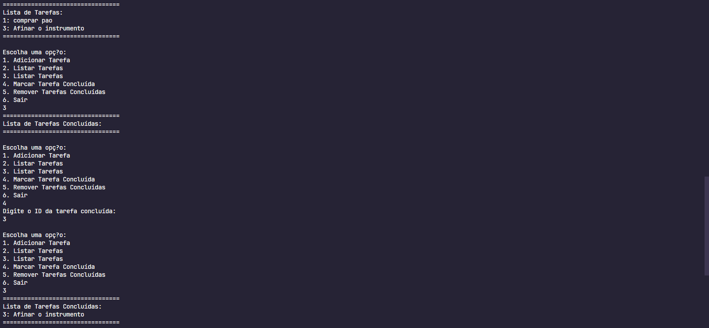
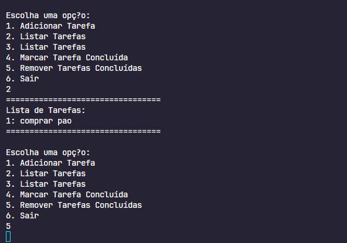

# To do List

Uma pequena lista de tarefas para o dia a dia em redis no Java.

O banco utilizado para o projeto é foi removido pra evitar registros, logo a chave no projetto não é válido.

## Prints do to do list funcionando

